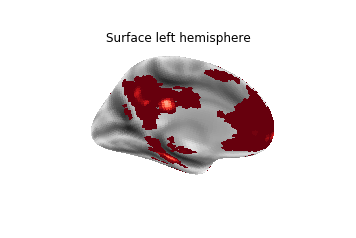
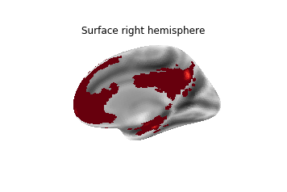
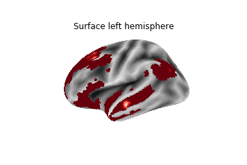
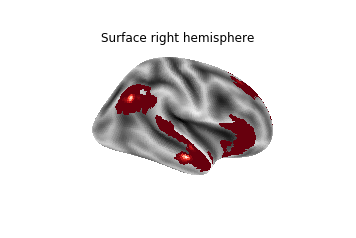

# Brain map of exercise effects

This notebook documents the generation of a brain map describing where there have been observations of relations between physical activity and fitness with brain structure or function. We use [GingerALE](http://brainmap.org/ale/manual.pdf) to generate the brain map.


### Coding effects

Code functional connectivity effects for DMN related seeds, from the following papers:
* Voss, M., Erickson, K., Prakash, R., Chaddock, L., Malkowski, E., Alves, H., Kim, J., Morris, K., White, S., Wójcicki, T., Hu, L., Szabo, A., Klamm, E., McAuley, E., Kramer, A., 2010. Functional connectivity: a source of variance in the association between cardiorespiratory fitness and cognition? Neuropsychologia 48(5), 1394-1406.
    * cross-sectional fc with CRF from HALT trial baseline
* Voss, M., Prakash, R., Erickson, K., Basak, C., Chaddock, L., Kim, J., Alves, H., Heo, S., Szabo, A., White, S., Wojcicki, T., Mailey, E., Gothe, N., Olson, E., McAuley, E., Kramer, A., 2010. Plasticity of brain networks in a randomized intervention trial of exercise training in older adults. Front Aging Neurosci 2.
    * RCT, intervention effects from HALT 
    * code only DMN seeds where there was an effect at 12mo
* Boraxbekk, C.J., Salami, A., Wahlin, A., Nyberg, L., 2016. Physical activity over a decade modifies age-related decline in perfusion, gray matter volume, and functional connectivity of the posterior default-mode network-A multimodal approach. Neuroimage 131, 133-141.
    * prospective, current and accumulated PA based on composite of self-report and proxy measures of physical health like BMI
* Voss, M., Weng, T., Burzynska, A., Wong, C., Cooke, G., Clark, R., Fanning, J., Awick, E., Gothe, N., Olson, E., McAuley, E., Kramer, A., 2016. Fitness, but not physical activity, is related to functional integrity of brain networks associated with aging. NeuroImage 131, 113-125.
     * cross-sectional fc with CRF from FAST trial baseline
* Chirles, T.J., Reiter, K., Weiss, L.R., Alfini, A.J., Nielson, K.A., Smith, J.C., 2017. Exercise Training and Functional Connectivity Changes in Mild Cognitive Impairment and Healthy Elders. J Alzheimers Dis 57(3), 845-856.
    * small training study with MCI participants
    * only coded effects for time * group 
* Flodin, P., Jonasson, L.S., Riklund, K., Nyberg, L., Boraxbekk, C.J., 2017. Does Aerobic Exercise Influence Intrinsic Brain Activity? An Aerobic Exercise Intervention among Healthy Old Adults. Front Aging Neurosci 9, 267.
     * training study with healthy older adults 
     * caveat: may have used entire anatomical hippocampus ROI for functional seed
* Stillman, C.M., Uyar, F., Huang, H.Q., Grove, G.A., Watt, J.C., Wollam, M.E., Erickson, K.I., 2018. Cardiorespiratory fitness is associated with enhanced hippocampal functional connectivity in healthy young adults. Hippocampus 28(3), 239-247.
    * cross-sectional with healthy young adults 
    * caveat: anatomical ROIs for anterior and posterior hipp seeds

Not included
* Burdette 2010
    * no coordinates


```python
%%bash

# Can list multiple coordinates for a given study

echo "
//Reference=MNI
//Voss,2010a
//Subjects=120
-28 18 48
-4 50 -4
62 -12 -18
-56 -14 -16
-16 -58 30
30 -24 -14
-24 -40 -18


//Voss,2010b
//Subjects=75
-24 -26 -20
24 -26 -20
-52 -18 -18
58 -10 -18
-44 -72 34
54 -62 32
-30 20 50


//Boraxbekk,2015
//Subjects=308
-8 -32 26


//Boraxbekk,2015
//Subjects=196
-6 -32 26


//Voss,2016
//Subjects=189
-24 24 42
-6 62 -4
22 28 44
-6 -54 32
6 -60 32
6 62 -4
62 -10 -16
50 -62 34
-24 -26 -20
-52 -18 -18

//Chirles,2017
//Subjects=32
-2 -50 36
48 -70 38


//Flodin,2017
//Subjects=60
14 2 58
-22 -6 56
28 -62 58
22 48 32
36 -48 30
-48 14 6
-32 30 -8


//Stillman,2018
//Subjects=50
-16 -30 -20
-10 68 -4
26 46 -22
66 -46 -16
-34 -26 -30
8 -60 38
-30 42 -20
-2 60 14" > foci_fc.txt
```


```python
%%bash

cat foci_fc.txt
```


```python
%%bash

# should be 1.8
# java -version
```

## Meta-analyzing with GingerALE

* The command line seems to hang on me, so I used the GUI
* Run GUI by double-clicking on GingerALE.jar application
    * Threshold at p<.001 because there are very few studies and we're most interested in any consistency in spatial pattern, so we want to see the most possible hits across studies. We will then overlay this summary image on the DMN to evaluate whether the hits are falling within the DMN or not.

## Prep in relation to DMN

Output
* foci_fc_ALE_p001.nii
* MNI-152 space
* LPI orientation
    * Our maps from the Schaefer/Yeo parcellation and any other maps we have are in RPI orientation. So to view together in nilearn, we'll reorient the ALE output to LPI.


```python
%%bash

# swap on x dimension to flip from LPI to RPI
fslswapdim foci_fc_ALE_p001.nii -x y z foci_fc_ALE_p001_RPI

# ensure header consistent too
fslorient -swaporient foci_fc_ALE_p001_RPI.nii.gz

# the DMN map is made from summing all parcels labeled DMN in the Schaefer 400 parcellation
# e.g., for roi in $(find ${PWD} -maxdepth 1 -type f -name "*Default*"| grep -v ".txt"); do echo -add ${roi} \\; done
# use output with an fslmaths command to add them and bin
# fslmaths 17Networks_Default.nii.gz -bin 17Networks_Default_bin.nii.gz

# resample ALE image into MNI152 space of DMN map
flirt -in 17Networks_Default_bin.nii.gz -ref foci_fc_ALE_p001_RPI.nii.gz -out 17Networks_Default_bin_resample.nii.gz
fslmaths 17Networks_Default_bin_resample.nii.gz -bin 17Networks_Default_resample_bin.nii.gz

# scale down map so clusters are highly distinct in gradient when added in
fslmaths 17Networks_Default_resample_bin.nii.gz -div 100000000000 17Networks_Default_resample_bin_scaled.nii.gz

# add the ALE image to the DMN binarized map for easy viewing on the surface together
fslmaths 17Networks_Default_resample_bin_scaled.nii.gz -add foci_fc_ALE_p001_RPI.nii.gz foci_fc_ALE_p001_RPI_underlay-DMN.nii.gz
```

## Viewing results

Plot onto a surface image using nilearn, since DMN is primarily cortical.


```python
# load python packages for plotting results

from nilearn import plotting
from nilearn import image
%matplotlib inline
```


```python
# plot on fsaverage surface
from nilearn import datasets
from nilearn import surface
fsaverage = datasets.fetch_surf_fsaverage5()

# set the img as your 3D volume to plot
ale_img='foci_fc_ALE_p001_RPI_underlay-DMN.nii.gz'

# transform volume to a surface image
# usage: http://nilearn.github.io/modules/generated/nilearn.surface.vol_to_surf.html
texture_left = surface.vol_to_surf(ale_img, fsaverage.pial_left)
texture_right = surface.vol_to_surf(ale_img, fsaverage.pial_right)

# plots
# usage: http://nilearn.github.io/modules/generated/nilearn.plotting.plot_surf_stat_map.html

```


```python
# left medial
display=plotting.plot_surf_stat_map(fsaverage.infl_left, texture_left, hemi='left', view='medial',
                            title='Surface left hemisphere',
                            threshold=None, bg_map=fsaverage.sulc_left,
                            cmap='Reds_r')

```





```python
# right medial
display=plotting.plot_surf_stat_map(fsaverage.infl_right, texture_right, hemi='right',view='medial',
                            title='Surface right hemisphere',
                            threshold=None, bg_map=fsaverage.sulc_right,
                            cmap='Reds_r')
```





```python
# left lateral
display=plotting.plot_surf_stat_map(fsaverage.infl_left, texture_left, hemi='left',view='lateral',
                            title='Surface left hemisphere',
                            threshold=None, bg_map=fsaverage.sulc_left,
                            cmap='Reds_r')
```





```python
# right lateral
display=plotting.plot_surf_stat_map(fsaverage.infl_right, texture_right, hemi='right',view='lateral',
                            title='Surface right hemisphere',
                            threshold=None, bg_map=fsaverage.sulc_right,
                            cmap='Reds_r')
```




