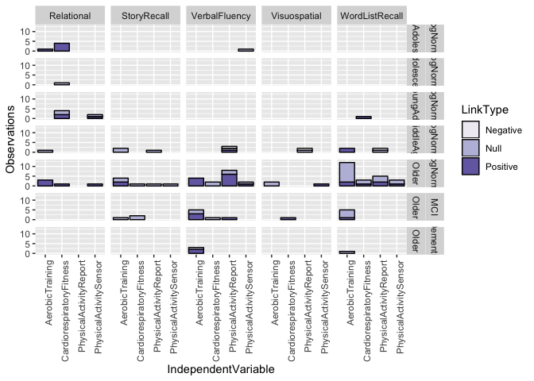
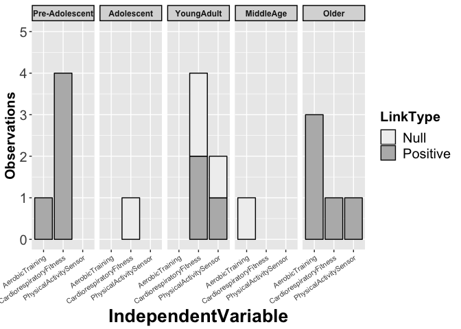

R Notebook for visualizing exercise effects on learning and memory
================

-   [Load data and subset based on goal](#load-data-and-subset-based-on-goal)
-   [Load and specify cross-sectional data](#load-and-specify-cross-sectional-data)
-   [Plot interventions and cross-sectional together](#plot-interventions-and-cross-sectional-together)
-   [plot relational memory by task and age groups across the lifespan](#plot-relational-memory-by-task-and-age-groups-across-the-lifespan)

**Goal**: Display links between independent variables (physical activity, aerobic training, etc) and dependent variables (memory) in the form of a stacked bar graph that indicates number of studies with each outcome (dependent) and proportion positive or null results. This approach is similar to the [Beydoun et al., 2014 meta-analysis](https://github.com/mwvoss/physical-activity-outcomes/blob/master/key-sources/Beydoun-2014-Epidemiologic%20studies%20of%20modifiab.pdf) which summarizes results based on the result of testing the hypothesis that physical activity reduces cognitive decline and dementia in cross-sectional and prospective observational studies.

**Method**: There have recently been a number of meta-analyses that summarize the effects of aerobic exercise training on different aspects of cognition. Meta-analyses allow for summarizing results of different cognitive tasks across multiple studies, but in the summary process different cognitive tasks are grouped together as reflecting a common cognitive construct. While this can be valuable, several standardized neuropsychological tasks have been commonly administered which on their own have shown to be useful for predicting accelerated age-related cognitive decline, cognitive impairment, and risk of progressing to dementia. These include tasks of delayed recall on word list learning tasks (e.g., RAVLT, HVLT, CVLT), delayed recall of details from stories (e.g., logical memory), visuospatial configural memory (e.g., complex figure), and verbal fluency. In addition, the hippocampus is a known site of deterioration with Alzheimer's type dementia, and tasks that are designed to tap into subtle decline of hippocampal function may be fruitful for early detection of physical activity effects on the deterioration process. We therefore aimed to summarize the effects of exercise training, physical activity, and the clinically significant physiological outcome of cardiorespiratory fitness (CRF) on these outcomes.

To summarize randomized controlled trials systematically, we aggregated studies included in eleven recent meta-analyses of exercise effects on cognition: </br> 1. Colcombe, S., Erickson, K., Raz, N., Webb, A., Cohen, N., McAuley, E., Kramer, A., 2003. Aerobic fitness reduces brain tissue loss in aging humans. J Gerontol A Biol Sci Med Sci 58(2), 176-180.</br> 2. Heyn, P., Abreu, B., Ottenbacher, K., 2004. The effects of exercise training on elderly persons with cognitive impairment and dementia: a meta-analysis. Arch Phys Med Rehabil 85(10), 1694-1704. </br> 3. Smith, P., Blumenthal, J., Hoffman, B., Cooper, H., Strauman, T., Welsh-Bohmer, K., Browndyke, J., Sherwood, A., 2010. Aerobic exercise and neurocognitive performance: a meta-analytic review of randomized controlled trials. Psychosom Med 72(3), 239-252. </br> 4. Roig, M., Nordbrandt, S., Geertsen, S., Nielsen, J., 2013. The effects of cardiovascular exercise on human memory: a review with meta-analysis. Neurosci Biobehav Rev 37(8), 1645-1666. </br> 5. Law, L., Barnett, F., Yau, M., Gray, M., 2014. Effects of combined cognitive and exercise interventions on cognition in older adults with and without cognitive impairment: a systematic review. Ageing Res Rev 15, 61-75. </br> 6. Forbes, D., Forbes, S.C., Blake, C.M., Thiessen, E.J., Forbes, S., 2015. Exercise programs for people with dementia. Cochrane Database Syst Rev(4), CD006489. </br> 7. Young, J., Angevaren, M., Rusted…, J., 2015. Aerobic exercise to improve cognitive function in older people without known cognitive impairment. The Cochrane … 4, CD005381. </br> 8. Kane, R.L., Butler, M., Fink, H.A., Brasure, M., Davila, H., Desai, P., 2017. Interventions to Prevent Age-Related Cognitive Decline, Mild Cognitive Impairment, and Clinical Alzheimer’s-Type Dementia. </br> 9. Barha, C.K., Davis, J.C., Falck, R.S., Nagamatsu, L.S., Liu-Ambrose, T., 2017. Sex differences in exercise efficacy to improve cognition: A systematic review and meta-analysis of randomized controlled trials in older humans. Front Neuroendocrinol 46, 71-85.</br> 10. Northey, J.M., Cherbuin, N., Pumpa, K.L., Smee, D.J., Rattray, B., 2018. Exercise interventions for cognitive function in adults older than 50: a systematic review with meta-analysis. Br J Sports Med 52(3), 154-160. </br> 11. Panza, G.A., Taylor, B.A., MacDonald, H.V., Johnson, B.T., Zaleski, A.L., Livingston, J., Thompson, P.D., Pescatello, L.S., 2018. Can Exercise Improve Cognitive Symptoms of Alzheimer's Disease? A Meta-Analysis. J Am Geriatr Soc. </br>

Papers extracted from these meta-analyses were aggregated to a database and the following search terms were used to identify studies that used specific tasks of interest as outcomes: </br>
\* RAVLT, “rey auditory”, “verbal learning”, CVLT, “california modified (CVLT)”, “california modified”, “california verbal”, “california learning”, HVLT, hopkins, “hopkins verbal”, “Paired associate”, “ROCF”, “Rey-Osterrieth Complex Figure (ROCF)”, “rey-osterrieth”, “rey osterrieth complex figure”, logical memory, “verbal fluency”, allocentric, “pattern separation”, “object discrimination”, “spatial navigation”, wayfinding, “relational memory” </br>

Effects were excluded due to lack of reported outcome data, the primary intervention was acute (single session), the intervention was not targeted to the aerobic system, results were only reported for cognitive composite scores. From these studies we summarize the proportion of studies that examined aerobic training or multicomponent training on cognitive tasks with demonstrated clinical relevance for predicting cognitive decline or impairment or which have been proposed to specifically tap into processes that require the hippocampus (e.g., pattern separation, spatial navigation, relational memory). </br>

In addition we systematically aggregated studies using a cross-sectional design by searching pubmed with the following search term combinations: </br>

((((cardiorespiratory fitness) OR fitness) OR physical activity) OR physical exercise) AND </br> RAVLT </br> CVLT </br> HVLT </br> "list learning" </br>
"relational memory" </br>
"paired associates" </br>
"ROCF" </br> "logical memory" </br>
"verbal fluency" </br> allocentric </br> “pattern separation” </br>
“object discrimination” </br>
“spatial navigation” </br> wayfinding </br> “relational memory” </br>

Studies were eligible for summary that used a human population that was cognitively normal and deviated from normal only based on age-related cognitive impairment or dementia (e.g., psychiatric diseases were excluded), design must have been observational (cross-sectional or prospective), and the study had to be available in english. </br>

Load data and subset based on goal
==================================

``` r
rm(list=ls(all=TRUE))  #clear previous
library(dplyr)
library(tidyr)
library(ggplot2)
library(RColorBrewer)

# load intervention database 
interventions = read.csv("InterventionOutcomesR.csv", header = TRUE, sep = ",")
interventions <-subset(interventions,interventions$MetaInclude == "Y")

# keep monti for relational memory graph
interventions_monti = read.csv("InterventionOutcomesR.csv", header = TRUE, sep = ",")
interventions_monti <- subset(interventions_monti,interventions_monti$StudyName == "Monti2012")
interventions <- rbind(interventions,interventions_monti)

# keep only intervention design as independent variable, keep only intervention for comparison and not many of others
interventions <-subset(interventions,interventions$IndependentVariable == "AerobicTraining")

# exclude Major Depressive Disorder
interventions <-subset(interventions,interventions$CognitiveStatus != "MajorDepressiveDisorder")

# keep only intervention outcomes that are cognitive/memory rather than brain
interventions <-subset(interventions,interventions$DependentVariable == "VerbalFluency" | interventions$DependentVariable == "VerbalPairedAssociates" | interventions$DependentVariable == "PairedAssociates" |interventions$DependentVariable == "LogicalMemory" | interventions$DependentVariable == "ComplexFigure" | interventions$DependentVariable == "ListLearning" | interventions$DependentVariable == "RAVLT" | interventions$DependentVariable == "CVLT" | interventions$DependentVariable == "AVLT" | interventions$DependentVariable == "HVLT" | interventions$DependentVariable == "Relational")


# keep only delayed recall
interventions <-subset(interventions,interventions$DependentType != "Immediate")

# remove linktype NA or unknown age
interventions <-subset(interventions,interventions$LinkType != "NA")
interventions <-subset(interventions,interventions$AgeGroup != "NA")

# data structure
str(interventions)
```

    ## 'data.frame':    58 obs. of  25 variables:
    ##  $ StudyName              : Factor w/ 151 levels "Adlard2011","Aguiar2011",..: 51 51 104 107 107 96 96 113 140 10 ...
    ##  $ MetaInclude            : Factor w/ 2 levels "N","Y": 2 2 2 2 2 2 2 2 2 2 ...
    ##  $ Design                 : Factor w/ 3 levels "","Acute","Intervention": 3 3 3 3 3 3 3 3 3 3 ...
    ##  $ IndependentVariable    : Factor w/ 10 levels "","AerobicFitness",..: 3 3 3 3 3 3 3 3 3 3 ...
    ##  $ IndependentType        : Factor w/ 11 levels "","Activity",..: 2 2 2 2 2 2 2 2 2 2 ...
    ##  $ DependentVariable      : Factor w/ 39 levels "","AVLT","BDNf",..: 2 2 20 20 39 2 2 2 2 7 ...
    ##  $ DependentType          : Factor w/ 42 levels "","2way","BasalForebrainProtein",..: 21 30 11 11 38 11 30 1 11 8 ...
    ##  $ DependentSubType       : Factor w/ 23 levels "","Acquisition",..: 12 12 23 23 23 5 5 12 1 19 ...
    ##  $ LinkType               : Factor w/ 4 levels "","Negative",..: 4 4 3 3 3 3 3 4 3 3 ...
    ##  $ TotalSampleSize        : int  68 68 57 99 99 120 120 62 152 51 ...
    ##  $ InterventionDurationWks: num  24 24 26 16 16 40 40 24 52 24 ...
    ##  $ ExperimentalGroup      : Factor w/ 15 levels "","Aerobic","AerobicMiddleAged",..: 2 2 15 2 2 13 13 2 2 2 ...
    ##  $ ExperimentalGroupN     : int  36 36 22 41 41 30 30 20 77 23 ...
    ##  $ ExperimentalGroup2     : Factor w/ 20 levels "","Aerobic","AerobicAged",..: 17 17 2 14 14 19 19 17 1 9 ...
    ##  $ ExperimentalGroup2N    : int  32 32 15 35 35 30 30 21 NA 11 ...
    ##  $ ExperimentalGroup3     : Factor w/ 9 levels "","Cognitive",..: 1 1 1 1 1 8 8 1 1 1 ...
    ##  $ ExperimentalGroup3N    : int  NA NA NA NA NA 30 30 NA NA NA ...
    ##  $ ControlGroup           : Factor w/ 18 levels "","Cognitive",..: 9 9 17 17 17 10 10 10 15 17 ...
    ##  $ ControlGroupN          : int  18 18 20 23 23 30 30 21 75 17 ...
    ##  $ MeanAge                : num  48.1 48.1 48.5 44.3 44.3 ...
    ##  $ PercFemale             : num  66 66 93 62 62 ...
    ##  $ AgeGroup               : Factor w/ 5 levels "Adolescent","MiddleAge",..: 2 2 2 2 2 3 3 3 3 3 ...
    ##  $ CognitiveStatus        : Factor w/ 5 levels "","CognitivelyNormal",..: 2 2 2 2 2 2 2 2 2 2 ...
    ##  $ Species                : Factor w/ 3 levels "Human","Mice",..: 1 1 1 1 1 1 1 1 1 1 ...
    ##  $ Model                  : Factor w/ 19 levels "","APP/PS1","Back-crossingfrom129/SvbyC57BL/6",..: 1 1 1 1 1 1 1 1 1 1 ...

``` r
# create a dependent construct variable to collapse across task variants when needed
interventions$DependentConstruct <- interventions$DependentVariable

interventions$DependentConstruct <- ifelse(interventions$DependentConstruct == "AVLT","WordListRecall",
                                    ifelse(interventions$DependentConstruct == "CVLT","WordListRecall",
                                    ifelse(interventions$DependentConstruct == "HVLT","WordListRecall",
                                    ifelse(interventions$DependentConstruct == "ListLearning","WordListRecall",
                                    ifelse(interventions$DependentConstruct == "RAVLT","WordListRecall",
                                    ifelse(interventions$DependentConstruct == "LogicalMemory","StoryRecall",
                                    ifelse(interventions$DependentConstruct == "Relational","Relational",
                                    ifelse(interventions$DependentConstruct == "VerbalPairedAssociates","Relational",
                                    ifelse(interventions$DependentConstruct == "PairedAssociates","Relational",
                                    ifelse(interventions$DependentConstruct == "VerbalFluency","VerbalFluency",
                                    ifelse(interventions$DependentConstruct == "ComplexFigure","Visuospatial","Other")))))))))))

# re-label cognitive status variable
interventions$CognitiveStatus<-factor(interventions$CognitiveStatus,levels=c("CognitivelyNormal","MCI","Dementia"),labels=c("CogNormal","MCI","Dementia"))
```

Load and specify cross-sectional data
=====================================

``` r
crossx = read.csv("CrossSectionalOutcomesR.csv", header = TRUE, sep = ",")

# clear out immediate recall
crossx <-subset(crossx,crossx$DependentType != "Immediate")
crossx <-subset(crossx,crossx$DependentType != "Learning")
crossx <-subset(crossx,crossx$DependentType != "Composite")
crossx <-subset(crossx,crossx$DependentType != "NotSpecified")
crossx <-subset(crossx,crossx$DependentType != "Copy")

# not enough discrimination to include
crossx <-subset(crossx,crossx$DependentVariable != "MnemonicDiscrimination")

# factorize cognitive status variable
crossx$CognitiveStatus<-factor(crossx$CognitiveStatus,levels=c("CognitivelyNormal","MCI","Dementia"))
```

``` r
# create a dependent construct variable to collapse across 
crossx$DependentConstruct <- crossx$DependentVariable

crossx$DependentConstruct <- ifelse(crossx$DependentConstruct == "AVLT","WordListRecall",
                                    ifelse(crossx$DependentConstruct == "CVLT","WordListRecall",
                                    ifelse(crossx$DependentConstruct == "HVLT","WordListRecall",
                                    ifelse(crossx$DependentConstruct == "ListLearning","WordListRecall",
                                    ifelse(crossx$DependentConstruct == "RAVLT","WordListRecall",
                                    ifelse(crossx$DependentConstruct == "LogicalMemory","StoryRecall",
                                    ifelse(crossx$DependentConstruct == "VerbalPairedAssociates","Relational",
                                    ifelse(crossx$DependentConstruct == "RelationalMemory","Relational",
                                    ifelse(crossx$DependentConstruct == "VerbalFluency","VerbalFluency",
                                    ifelse(crossx$DependentConstruct == "ROCF","Visuospatial",
                                    ifelse(crossx$DependentConstruct == "ComplexFigure","Visuospaial","Other")))))))))))
# re-label cognitive status variable
crossx$CognitiveStatus<-factor(crossx$CognitiveStatus,levels=c("CognitivelyNormal","MCI","Dementia"),labels=c("CogNormal","MCI","Dementia"))
```

Plot interventions and cross-sectional together
===============================================

``` r
# make subset dataframes for each with common columns
intervention_plot <- interventions  %>% select(StudyName,IndependentVariable,IndependentType,DependentConstruct,DependentVariable,DependentType,DependentSubType,LinkType,TotalSampleSize,AgeGroup,CognitiveStatus)

crossx_plot <- crossx  %>% select(StudyName,IndependentVariable,IndependentType,DependentConstruct,DependentVariable,DependentType,DependentSubType,LinkType,TotalSampleSize,AgeGroup,CognitiveStatus)

overall_plot <- rbind(intervention_plot,crossx_plot)
```

``` r
# re-order age group for chronological sense
overall_plot$AgeGroup <- relevel(overall_plot$AgeGroup,"Older")
overall_plot$AgeGroup <- relevel(overall_plot$AgeGroup,"MiddleAge")
overall_plot$AgeGroup <- relevel(overall_plot$AgeGroup,"YoungAdult")
overall_plot$AgeGroup <- relevel(overall_plot$AgeGroup,"Adolescent")
overall_plot$AgeGroup <- relevel(overall_plot$AgeGroup,"Pre-Adolescent")
levels(overall_plot$AgeGroup)
```

    ## [1] "Pre-Adolescent" "Adolescent"     "YoungAdult"     "MiddleAge"     
    ## [5] "Older"

``` r
# plot 

data_in_fig1<-subset(overall_plot,CognitiveStatus=="CogNormal")
write.csv(data_in_fig1,"data_in_fig1.csv", row.names=FALSE, na="")

# cognitively normal and middle age or older
ggplot(data=subset(overall_plot,CognitiveStatus=="CogNormal" & AgeGroup=="Older" | AgeGroup=="MiddleAge"))+
  geom_bar(mapping=aes(x=IndependentVariable,fill=LinkType),color="black") +
  scale_fill_manual(values=c("grey94","gray72", "gray39")) +
  labs(y="Observations") +
  ylim(0,17) +
  facet_grid(~DependentConstruct) +
  theme(title=element_text(size=20, face='bold'),
        axis.text.x = element_text(size=8,angle = 35, hjust = 1),
        axis.text.y = element_text(size=15),
        axis.title.y = element_text(size=15),
        legend.text = element_text(size=15),
        legend.title = element_text(size=15),
        strip.text = element_text(face="bold", size=9,lineheight=5.0), 
        strip.background = element_rect(colour="black", size=1))
```



``` r
ggsave(filename="LiteratureMemoryOutcomes.eps",width=8,units=c("in"),dpi=900)
```

    ## Saving 8 x 5 in image

plot relational memory by task and age groups across the lifespan
=================================================================

``` r
overall_plot_rel<-subset(overall_plot,DependentConstruct=="Relational")

ggplot(data=subset(overall_plot_rel,CognitiveStatus=="CogNormal"))+
  geom_bar(mapping=aes(x=IndependentVariable,fill=LinkType),color="black") +
  scale_fill_manual(values=c("grey94","gray72", "gray39")) +
  labs(y="Observations") +
  ylim(0,5) +
  facet_grid(~AgeGroup) +
  theme(title=element_text(size=20, face='bold'),
        axis.text.x = element_text(size=8,angle = 35, hjust = 1),
        axis.text.y = element_text(size=15),
        axis.title.y = element_text(size=15),
        legend.text = element_text(size=15),
        legend.title = element_text(size=15),
        strip.text = element_text(face="bold", size=9,lineheight=5.0), 
        strip.background = element_rect(colour="black", size=1))
```



``` r
ggsave(filename="LiteratureMemoryOutcomes-relational.pdf",width=8,units=c("in"),dpi=900)
```

    ## Saving 8 x 5 in image

``` r
ggsave(filename="LiteratureMemoryOutcomes-relational.eps",width=8,units=c("in"),dpi=900)
```

    ## Saving 8 x 5 in image
