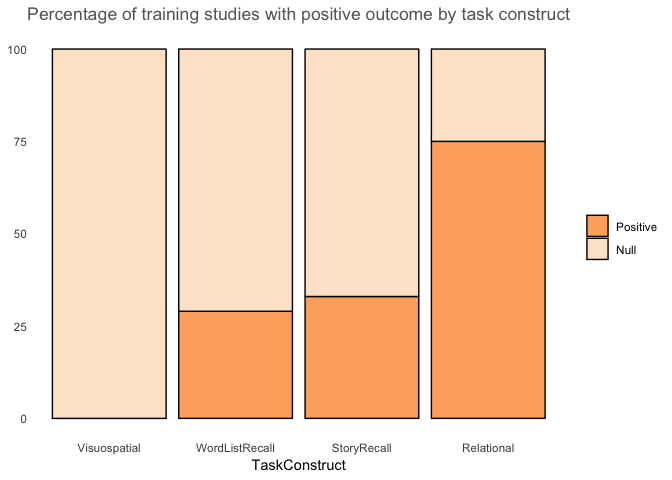

R Notebook for visualizing exercise effects on learning and memory
================

-   [Tally and plot intervention outcomes](#tally-and-plot-intervention-outcomes)

``` r
rm(list=ls(all=TRUE))  #clear previous
library(dplyr)
library(tidyr)
library(ggplot2)
library(RColorBrewer)


interventions = read.csv("InterventionOutcomesR.csv", header = TRUE, sep = ",")
interventions <-subset(interventions,interventions$MetaInclude == "Y")

# keep monti for relational memory graph
interventions_monti = read.csv("InterventionOutcomesR.csv", header = TRUE, sep = ",")
interventions_monti <- subset(interventions_monti,interventions_monti$StudyName == "Monti2012")
interventions <- rbind(interventions,interventions_monti)

# keep only intervention design as independent variable, keep only intervention for comparison and not many of others
interventions <-subset(interventions,interventions$IndependentVariable == "AerobicTraining")

# exclude Major Depressive Disorder
interventions <-subset(interventions,interventions$CognitiveStatus != "MajorDepressiveDisorder")

# keep only intervention outcomes that are cognitive/memory, exclude verbal fluency
interventions <-subset(interventions, interventions$DependentVariable == "VerbalPairedAssociates" | interventions$DependentVariable == "PairedAssociates" |interventions$DependentVariable == "LogicalMemory" | interventions$DependentVariable == "ComplexFigure" | interventions$DependentVariable == "ListLearning" | interventions$DependentVariable == "RAVLT" | interventions$DependentVariable == "CVLT" | interventions$DependentVariable == "AVLT" | interventions$DependentVariable == "HVLT" | interventions$DependentVariable == "Relational")


# keep only delayed recall
interventions <-subset(interventions,interventions$DependentType != "Immediate")

# remove linktype NA or unknown age
interventions <-subset(interventions,interventions$LinkType != "NA")
interventions <-subset(interventions,interventions$AgeGroup != "NA")


str(interventions)
```

    ## 'data.frame':    34 obs. of  25 variables:
    ##  $ StudyName              : Factor w/ 151 levels "Adlard2011","Aguiar2011",..: 51 51 104 107 107 96 96 113 140 10 ...
    ##  $ MetaInclude            : Factor w/ 2 levels "N","Y": 2 2 2 2 2 2 2 2 2 2 ...
    ##  $ Design                 : Factor w/ 3 levels "","Acute","Intervention": 3 3 3 3 3 3 3 3 3 3 ...
    ##  $ IndependentVariable    : Factor w/ 10 levels "","AerobicFitness",..: 3 3 3 3 3 3 3 3 3 3 ...
    ##  $ IndependentType        : Factor w/ 11 levels "","Activity",..: 2 2 2 2 2 2 2 2 2 2 ...
    ##  $ DependentVariable      : Factor w/ 39 levels "","AVLT","BDNf",..: 2 2 20 20 39 2 2 2 2 7 ...
    ##  $ DependentType          : Factor w/ 42 levels "","2way","BasalForebrainProtein",..: 21 30 11 11 38 11 30 1 11 8 ...
    ##  $ DependentSubType       : Factor w/ 23 levels "","Acquisition",..: 12 12 23 23 23 5 5 12 1 19 ...
    ##  $ LinkType               : Factor w/ 4 levels "","Negative",..: 4 4 3 3 3 3 3 4 3 3 ...
    ##  $ TotalSampleSize        : int  68 68 57 99 99 120 120 62 152 51 ...
    ##  $ InterventionDurationWks: num  24 24 26 16 16 40 40 24 52 24 ...
    ##  $ ExperimentalGroup      : Factor w/ 15 levels "","Aerobic","AerobicMiddleAged",..: 2 2 15 2 2 13 13 2 2 2 ...
    ##  $ ExperimentalGroupN     : int  36 36 22 41 41 30 30 20 77 23 ...
    ##  $ ExperimentalGroup2     : Factor w/ 20 levels "","Aerobic","AerobicAged",..: 17 17 2 14 14 19 19 17 1 9 ...
    ##  $ ExperimentalGroup2N    : int  32 32 15 35 35 30 30 21 NA 11 ...
    ##  $ ExperimentalGroup3     : Factor w/ 9 levels "","Cognitive",..: 1 1 1 1 1 8 8 1 1 1 ...
    ##  $ ExperimentalGroup3N    : int  NA NA NA NA NA 30 30 NA NA NA ...
    ##  $ ControlGroup           : Factor w/ 18 levels "","Cognitive",..: 9 9 17 17 17 10 10 10 15 17 ...
    ##  $ ControlGroupN          : int  18 18 20 23 23 30 30 21 75 17 ...
    ##  $ MeanAge                : num  48.1 48.1 48.5 44.3 44.3 ...
    ##  $ PercFemale             : num  66 66 93 62 62 ...
    ##  $ AgeGroup               : Factor w/ 5 levels "Adolescent","MiddleAge",..: 2 2 2 2 2 3 3 3 3 3 ...
    ##  $ CognitiveStatus        : Factor w/ 5 levels "","CognitivelyNormal",..: 2 2 2 2 2 2 2 2 2 2 ...
    ##  $ Species                : Factor w/ 3 levels "Human","Mice",..: 1 1 1 1 1 1 1 1 1 1 ...
    ##  $ Model                  : Factor w/ 19 levels "","APP/PS1","Back-crossingfrom129/SvbyC57BL/6",..: 1 1 1 1 1 1 1 1 1 1 ...

``` r
# create a dependent construct variable to collapse across 
interventions$DependentConstruct <- interventions$DependentVariable

interventions$DependentConstruct <- ifelse(interventions$DependentConstruct == "AVLT","WordListRecall",
                                    ifelse(interventions$DependentConstruct == "CVLT","WordListRecall",
                                    ifelse(interventions$DependentConstruct == "HVLT","WordListRecall",
                                    ifelse(interventions$DependentConstruct == "ListLearning","WordListRecall",
                                    ifelse(interventions$DependentConstruct == "RAVLT","WordListRecall",
                                    ifelse(interventions$DependentConstruct == "LogicalMemory","StoryRecall",
                                    ifelse(interventions$DependentConstruct == "Relational","Relational",
                                    ifelse(interventions$DependentConstruct == "VerbalPairedAssociates","Relational",
                                    ifelse(interventions$DependentConstruct == "PairedAssociates","Relational",
                                    ifelse(interventions$DependentConstruct == "ComplexFigure","Visuospatial","Other"))))))))))

interventions$CognitiveStatus<-factor(interventions$CognitiveStatus,levels=c("CognitivelyNormal","MCI","Dementia"),labels=c("CogNormal","MCI","Dementia"))
```

Tally and plot intervention outcomes
====================================

``` r
intervention_plot <- interventions  %>% select(StudyName,IndependentVariable,IndependentType,DependentConstruct,DependentVariable,DependentType,DependentSubType,LinkType,TotalSampleSize,AgeGroup,CognitiveStatus)
```

``` r
data_in_fig1a <- intervention_plot %>% filter(CognitiveStatus=="CogNormal") %>%
        filter(IndependentVariable=="AerobicTraining") %>%
        filter(AgeGroup=="Older" | AgeGroup=="MiddleAge") 

write.csv(data_in_fig1a,"data_in_fig1a.csv", row.names=FALSE, na="")
```

``` r
data_in_fig1a$LinkType <-as.factor(data_in_fig1a$LinkType)
data_in_fig1a$DependentConstruct <-as.factor(data_in_fig1a$DependentConstruct)
data_in_fig1a$DependentConstruct <- factor(data_in_fig1a$DependentConstruct, levels=c("Visuospatial","WordListRecall","StoryRecall","Relational"))
levels(data_in_fig1a$DependentConstruct)
```

    ## [1] "Visuospatial"   "WordListRecall" "StoryRecall"    "Relational"

``` r
levels(data_in_fig1a$LinkType)
```

    ## [1] ""         "Negative" "Null"     "Positive"

``` r
data_in_fig1a$LinkType <- droplevels(data_in_fig1a$LinkType)
levels(data_in_fig1a$LinkType)
```

    ## [1] "Null"     "Positive"

``` r
# cross construct by linktype
cross_construct_table <- table(data_in_fig1a$LinkType,data_in_fig1a$DependentConstruct)
addmargins(cross_construct_table)
```

    ##           
    ##            Visuospatial WordListRecall StoryRecall Relational Sum
    ##   Null                2             10           4          1  17
    ##   Positive            0              4           2          3   9
    ##   Sum                 2             14           6          4  26

``` r
proportions <- round(100*prop.table(cross_construct_table,2),digits=0)
proportions
```

    ##           
    ##            Visuospatial WordListRecall StoryRecall Relational
    ##   Null              100             71          67         25
    ##   Positive            0             29          33         75

Number of participants

``` r
data_in_fig1a$TotalSampleSize <- as.numeric(data_in_fig1a$TotalSampleSize)

sample_size <- data_in_fig1a %>%
        group_by(DependentConstruct) %>%
        summarise(TotalSampleSize = sum(TotalSampleSize))

sample_size
```

    ## # A tibble: 4 x 2
    ##   DependentConstruct TotalSampleSize
    ##   <fct>                        <dbl>
    ## 1 Visuospatial                   171
    ## 2 WordListRecall                2563
    ## 3 StoryRecall                    599
    ## 4 Relational                     248

``` r
proportions.df = as.data.frame(proportions)

colnames(proportions.df)[colnames(proportions.df)=="Var1"] <- "Result"
colnames(proportions.df)[colnames(proportions.df)=="Var2"] <- "TaskConstruct"

ggplot(proportions.df, aes(x=TaskConstruct, y=Freq, fill = Result)) +
        geom_bar(stat="identity", color="black") +
        labs(y = NULL, fill = NULL, 
         title = "Percentage of training studies with positive outcome by task construct") +
        scale_fill_brewer(palette="Oranges") +
        guides(fill = guide_legend(reverse=TRUE)) +
        theme_classic() +
        theme(axis.line = element_blank(),
          axis.ticks = element_blank(),
          plot.title = element_text(hjust = 0.5, color = "#666666"))
```



``` r
# order the constructs with relevel in the order of lowest to highest percentage of positives:
# visuospatial, Word list recall, Story Recall, Relational
# add % and n of studies and participants onto the graph manually for best placement

ggsave(filename="LiteratureMemoryOutcomes_stacked-bar.pdf",width=8,units=c("in"),dpi=900)
```

    ## Saving 8 x 5 in image
