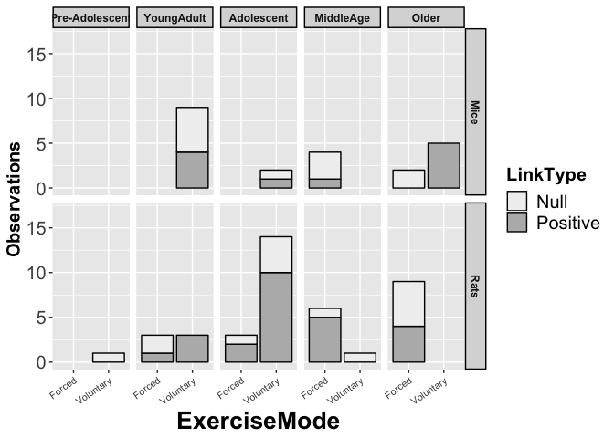

R Notebook for visualizing exercise effects on learning and memory in rodents
================

-   [Load data and subset based on goal](#load-data-and-subset-based-on-goal)
-   [Group tasks and age groups](#group-tasks-and-age-groups)
-   [Plot for spatial tasks](#plot-for-spatial-tasks)

**Goal**: Display links for PA and memory outcomes in animal models.

To summarize randomized controlled trials systematically, we aggregated studies included in eleven recent meta-analyses of exercise effects on cognition: </br> 1. Hatchard, T., Ting, J.J., Messier, C., 2014. Translating the impact of exercise on cognition: methodological issues in animal research. Behav Brain Res 273, 177-188.</br> 2. Barha, C.K., Falck, R.S., Davis, J.C., Nagamatsu, L.S., Liu-Ambrose, T., 2017. Sex differences in aerobic exercise efficacy to improve cognition: A systematic review and meta-analysis of studies in older rodents. Front Neuroendocrinol 46, 86-105. </br>

**Method**: We used the same methods for aggregating across studies as described for the summary of memory outcomes for [studies with humans](https://github.com/mwvoss/physical-activity-outcomes/blob/master/ExerciseRelationsBar.md). </br>

Age groups for animals were determined based on these sources for [mice](https://www.sciencedirect.com/science/article/pii/S0024320515300527?via%3Dihub) and [rats](https://www.researchgate.net/profile/Pallav_Sengupta2/publication/255716093_The_Laboratory_Rat_Relating_Its_Age_With_Human%27s/links/5608523f08ae8e08c0946154/The-Laboratory-Rat-Relating-Its-Age-With-Humans.pdf) </br>

Load data and subset based on goal
==================================

``` r
rm(list=ls(all=TRUE))  #clear previous
library(dplyr)
library(tidyr)
library(ggplot2)

interventions = read.csv("InterventionOutcomesR.csv", header = TRUE, sep = ",")
interventions <-subset(interventions,interventions$Species != "Human")
interventions <-subset(interventions,interventions$Model != "APP/PS1")
interventions <-subset(interventions,interventions$LinkType != "NA")
interventions <-subset(interventions,interventions$IndependentType != "Rotarod")

# keep cognitive outcomes of interest
interventions <-subset(interventions,interventions$DependentVariable == "Spatial" |interventions$DependentVariable == "SpatialAcquisition" | interventions$DependentVariable == "SpatialProbe")
```

Group tasks and age groups
==========================

``` r
interventions$DependentConstruct <- ifelse(interventions$DependentVariable == "Spatial","Spatial",
                                    ifelse(interventions$DependentVariable == "SpatialAcquisition","Spatial",
                                    ifelse(interventions$DependentVariable == "SpatialProbe","Spatial","Other")))
```

``` r
 interventions$AgeGroupPlot <- ifelse(interventions$AgeGroup == "Pre-Adolescent","Young",
                                    ifelse(interventions$AgeGroup == "Adolescent","Young",
                                    ifelse(interventions$AgeGroup == "YoungAdult","Young",
                                    ifelse(interventions$AgeGroup == "MiddleAge","Older",
                                    ifelse(interventions$AgeGroup == "Older","Older","Other")))))

interventions <- subset(interventions,interventions$AgeGroupPlot!="NA")

interventions <- subset(interventions,interventions$AgeGroup!="NA")


interventions$AgeGroup <- as.factor(interventions$AgeGroup)
interventions$AgeGroup <- relevel(interventions$AgeGroup,"YoungAdult")
interventions$AgeGroup <- relevel(interventions$AgeGroup,"Pre-Adolescent")

interventions$AgeGroupPlot <- as.factor(interventions$AgeGroupPlot)
interventions$AgeGroupPlot <- factor(interventions$AgeGroupPlot,levels=rev(levels(interventions$AgeGroupPlot)))
```

``` r
interventions$ExerciseMode <- ifelse(interventions$IndependentType == "ForcedSwimming","Forced",
                                    ifelse(interventions$IndependentType == "ForcedTreadmill","Forced",
                                    ifelse(interventions$IndependentType == "ForcedWheelRunning","Forced",
                                    ifelse(interventions$IndependentType == "MotorizedWheel","Forced",
                                    ifelse(interventions$IndependentType == "Treadmill","Forced",
                                    ifelse(interventions$IndependentType == "VoluntaryWheelRunning","Voluntary","Other"))))))
```

Plot for spatial tasks
======================

``` r
ggplot(data=subset(interventions))+
  geom_bar(mapping=aes(x=ExerciseMode,fill=LinkType),color="black") +
  scale_fill_manual(values=c("grey94","gray72", "gray39")) +
  labs(y="Observations") +
  ylim(0,17) +
  facet_grid(Species~AgeGroup) +
  theme(title=element_text(size=20, face='bold'),
        axis.text.x = element_text(size=8,angle = 35, hjust = 1),
        axis.text.y = element_text(size=15),
        axis.title.y = element_text(size=15),
        legend.text = element_text(size=15),
        legend.title = element_text(size=15),
        strip.text = element_text(face="bold", size=9,lineheight=5.0), 
        strip.background = element_rect(colour="black", size=1))
```



``` r
ggsave(filename="LiteratureMemoryRodentOutcomes.pdf",width=8,units=c("in"),dpi=300)
```

    ## Saving 8 x 5 in image

``` r
ggsave(filename="LiteratureMemoryRodentOutcomes.png",width=8,units=c("in"),dpi=300)
```

    ## Saving 8 x 5 in image
